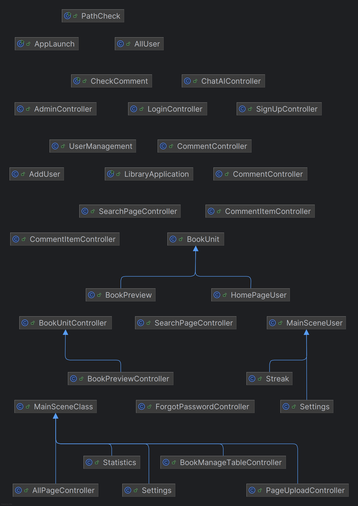
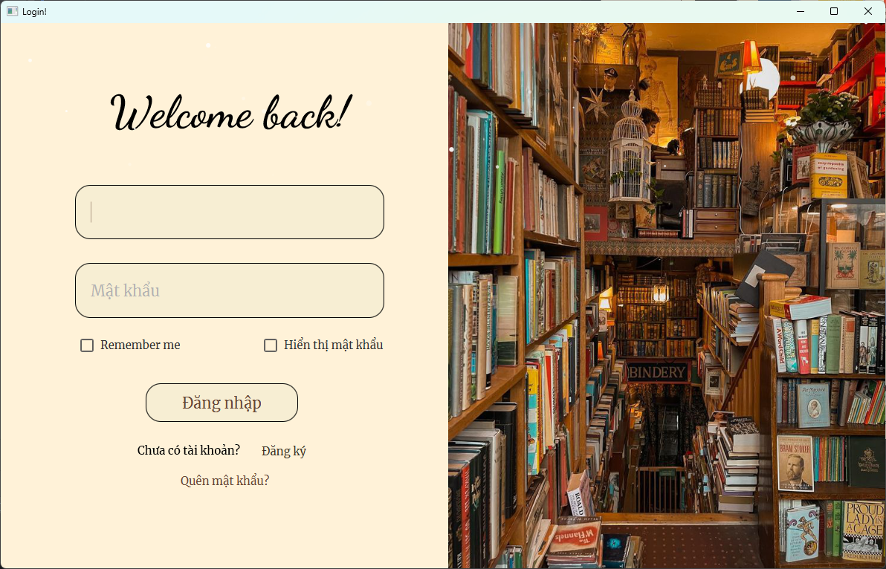
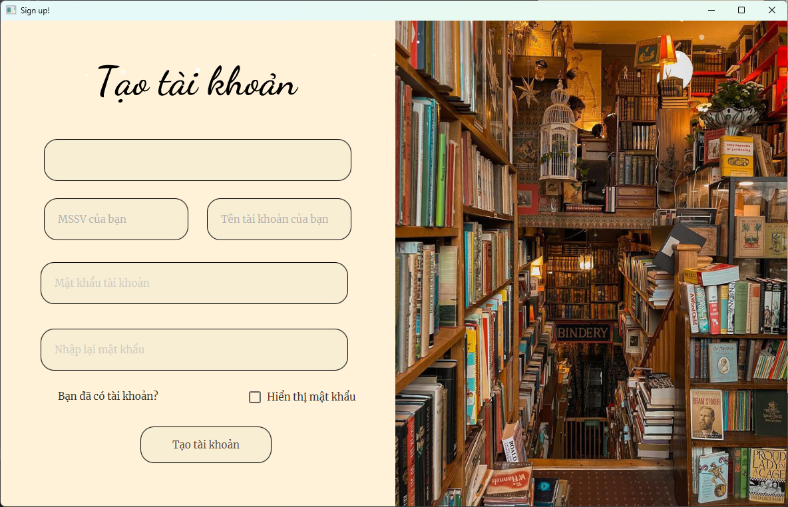
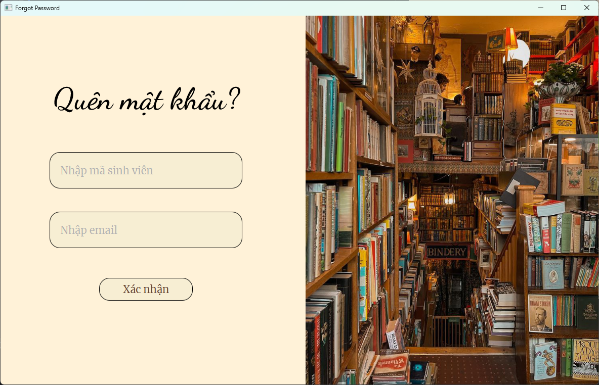
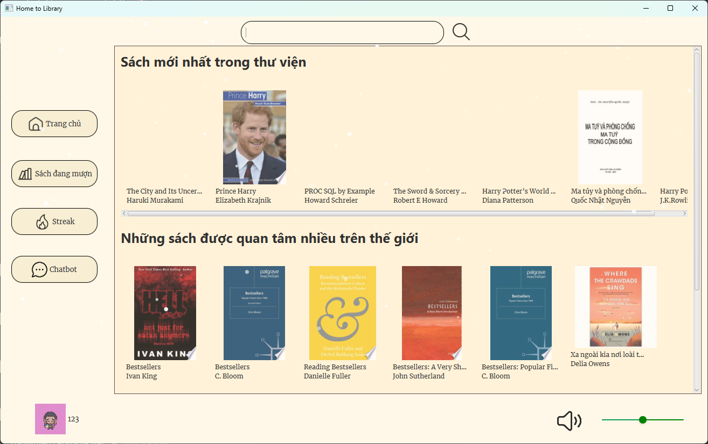
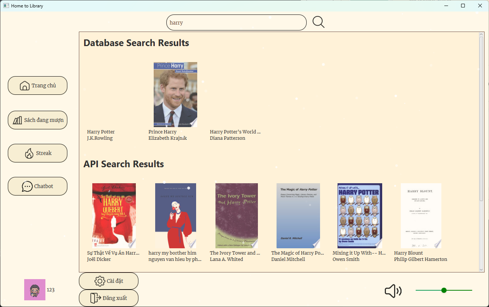
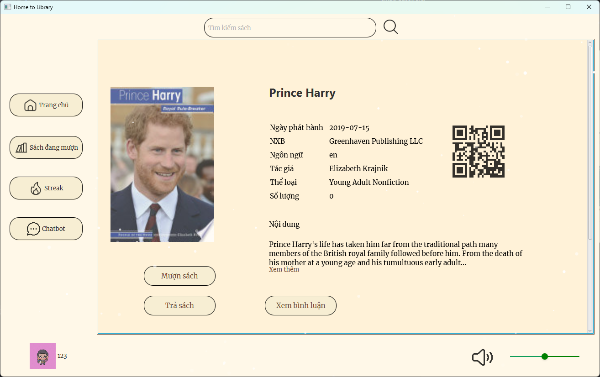
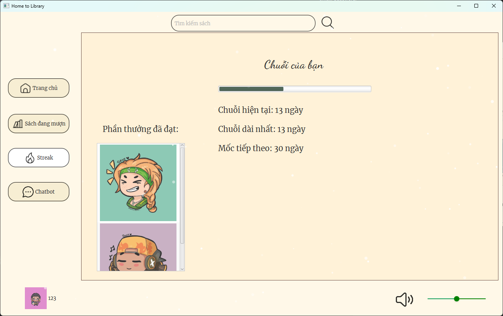
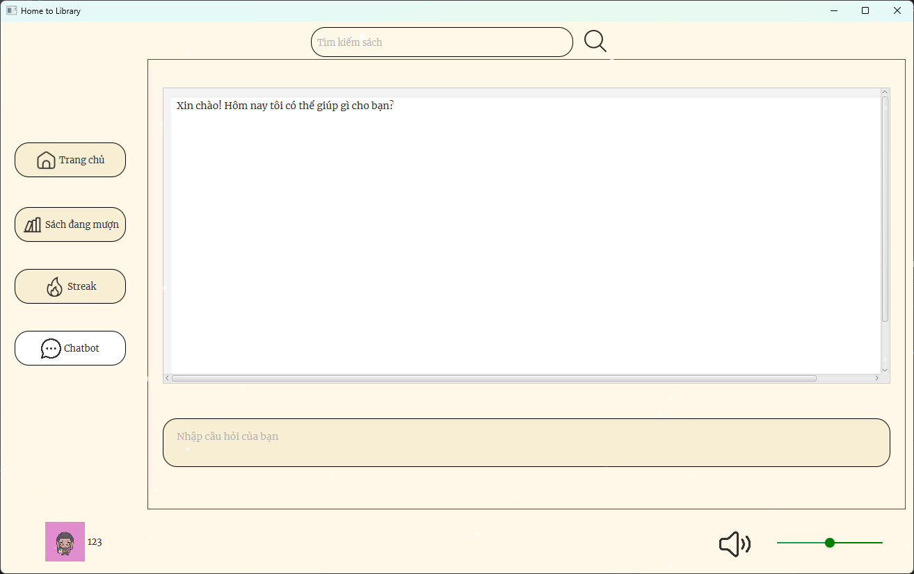
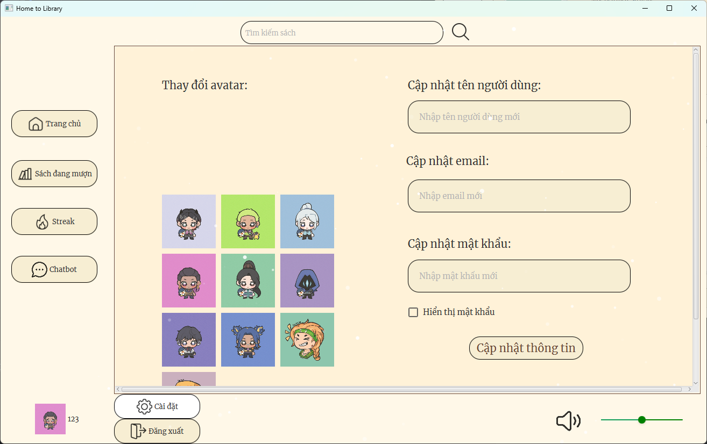

# Library management application using java
## Author
3 idiots
1. Dang Anh Que - 23020565
2. Vu Tien Tuan Trung - 23020576
3. Vu Thanh Tung - 23020572

## Description
The application is designed to manage library.
1. The application is written in Java and uses JavaFX library.
2. The application is based on MVC model.
3. The application uses JFoenix and ControlsFX for UI.
4. The application uses Google Books API for books database.
5. The application uses Gemini API for chatbot.
4. The application is designed to support librarian and student, teacher to borrow book.

## UML diagram

## Installation
1. Clone the project from the repository.
2. Locate and open the Library.jar file.
3. Run the project.

## Usage
1. Look up books: Select the books in the main menu or use the search bar.
2. Borrow and return books: After clicking on the desired books, click on the "Mượn"/"Trả" button.
3. Comment and rating: Scroll down from the book details to give comments and rating for the book.
4. View others comment: Click on the "Xem bình luận" to view others comment.
5. Streak: Click on the "Streak" button to track everyday login to keep a streak. Longer streaks can be converted to rewards.
6. Chatbot: Click on the "Chatbot" button to ask about books.
7. Settings: Click on the profile picture in the bottom left corner, choose "Cài đặt" to change avatars, username, email, password.
8. Logout: Instead of choosing "Cài đặt" like above, choose "Đăng xuất" to log out.

## Demo

## Future improvements
1. Add more books.
2. Add more games.
3. Add the search filter feature to promote more accurate search results.
4. Improve the user interface.

## Contributing
Pull requests are welcome. For major changes, please open an issue first to discuss what you would like to change.

## Project status
The project is completed.

## Notes
The application is written for educational purposes.
